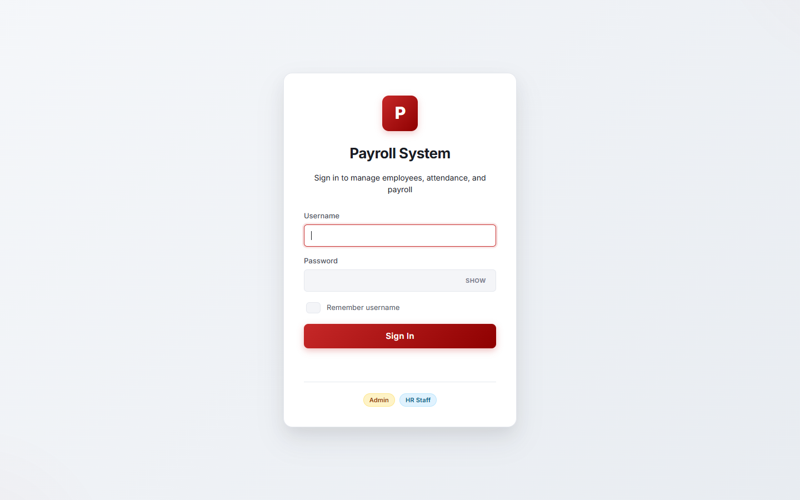
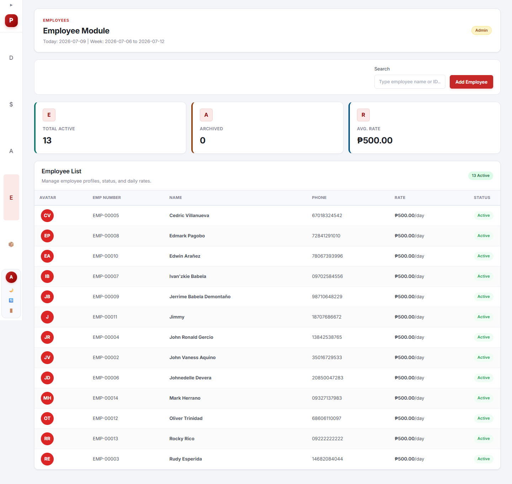
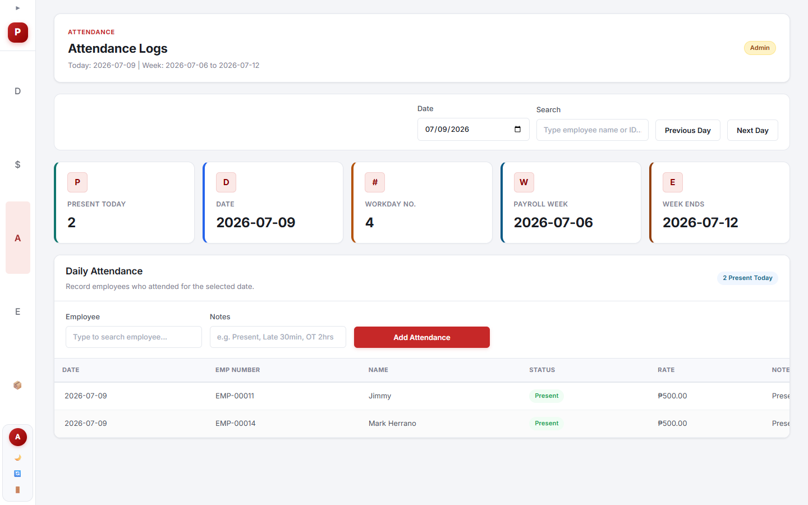
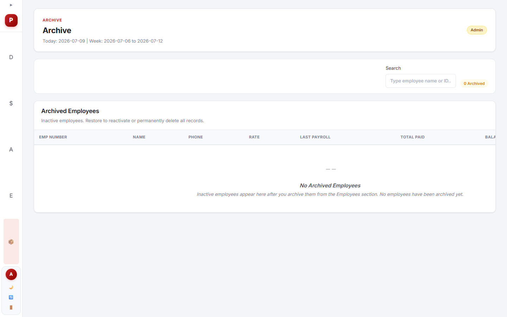
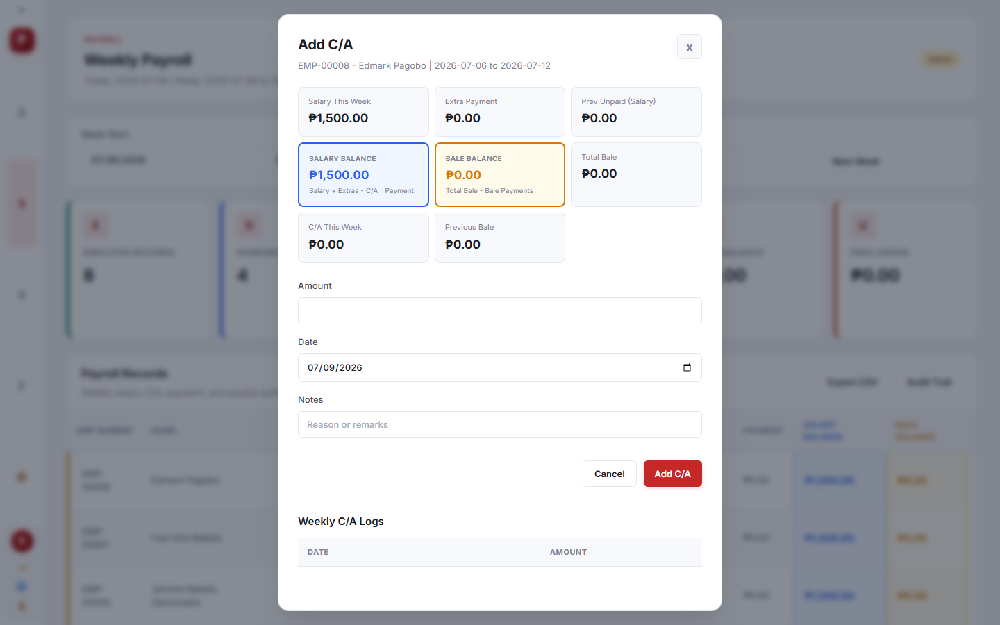
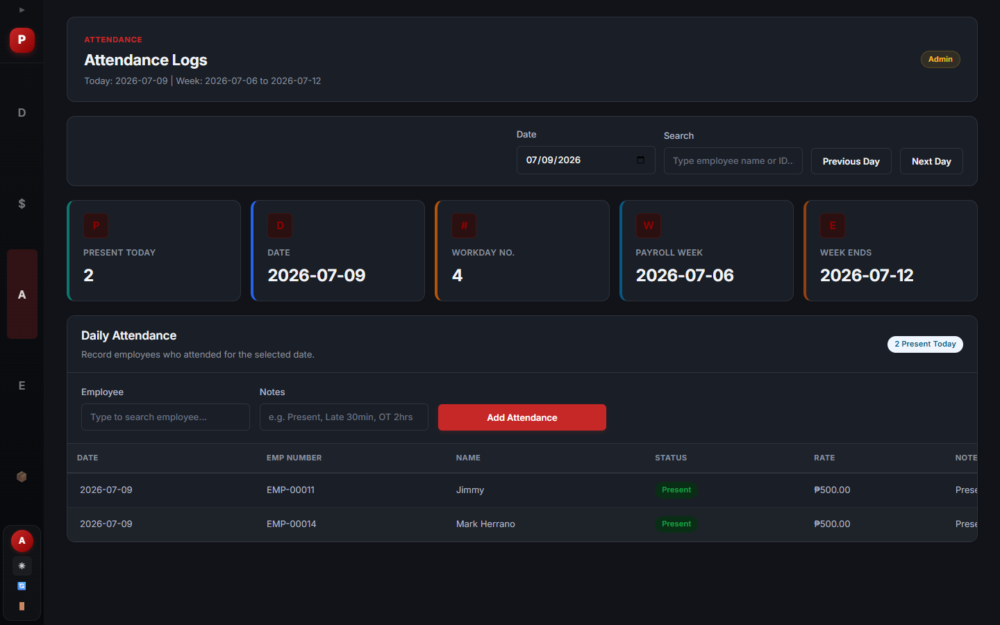
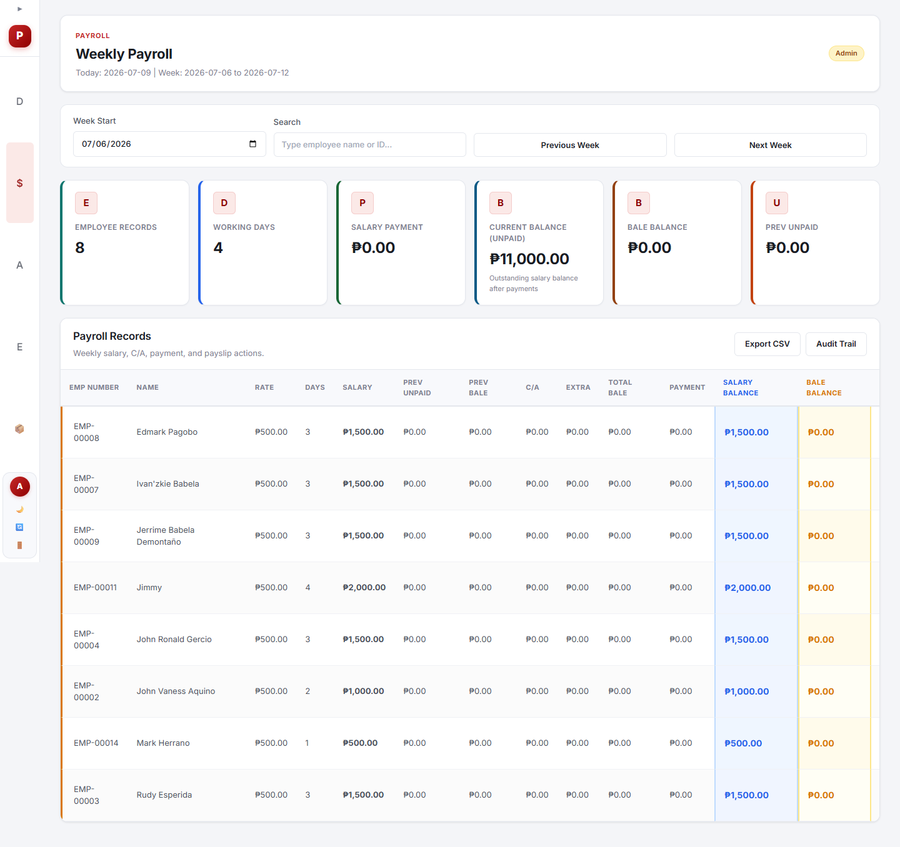
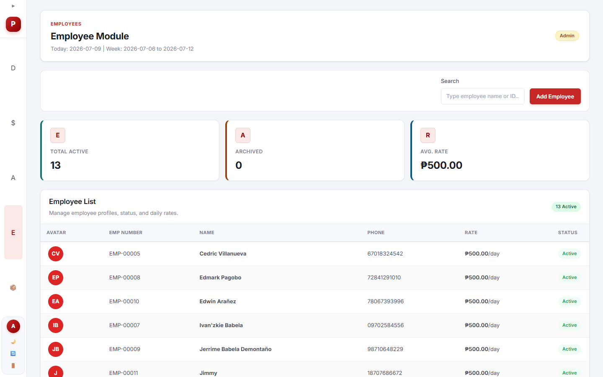

# Weekly Payroll and Attendance System

A full-stack web application for managing employee attendance, weekly payroll computation, cash advances, salary payments, and payslip generation. Built for **KVSK CCTV & IT Solutions**.

## Screenshots

<div align="center">
  <table>
    <tr>
      <td colspan="3" align="center"><strong>🔐 Login Screen</strong></td>
    </tr>
    <tr>
      <td colspan="3" align="center"></td>
    </tr>
    <tr>
      <td colspan="3" align="center"><em>Secure login page with role-based access (Admin / HR Staff)</em></td>
    </tr>
  </table>
</div>

<br>

<div align="center">
  <h3>☀️ Light Mode</h3>
  <table>
    <tr>
      <td><strong>Dashboard</strong></td>
      <td><strong>Payroll</strong></td>
      <td><strong>Attendance</strong></td>
    </tr>
    <tr>
      <td></td>
      <td></td>
      <td></td>
    </tr>
    <tr>
      <td><em>Summary cards, quick actions & stats</em></td>
      <td><em>Weekly payroll table with balances</em></td>
      <td><em>Daily attendance logging</em></td>
    </tr>
    <tr>
      <td><strong>Employees</strong></td>
      <td><strong>Archive</strong></td>
      <td><strong>Cash Advance</strong></td>
    </tr>
    <tr>
      <td></td>
      <td></td>
      <td></td>
    </tr>
    <tr>
      <td><em>Employee profiles, rates & status</em></td>
      <td><em>Archived employees with restore options</em></td>
      <td><em>Cash advance (bale) management</em></td>
    </tr>
  </table>
</div>

<br>

<div align="center">
  <h3>🌙 Dark Mode</h3>
  <table>
    <tr>
      <td><strong>Dashboard</strong></td>
      <td><strong>Payroll</strong></td>
      <td><strong>Attendance</strong></td>
    </tr>
    <tr>
      <td></td>
      <td></td>
      <td></td>
    </tr>
    <tr>
      <td><em>Dark theme dashboard</em></td>
      <td><em>Dark theme payroll table</em></td>
      <td><em>Dark theme attendance</em></td>
    </tr>
    <tr>
      <td><strong>Employees</strong></td>
      <td><strong></strong></td>
      <td><strong></strong></td>
    </tr>
    <tr>
      <td></td>
      <td colspan="2"><em>Dark theme employee management</em></td>
    </tr>
  </table>
</div>

## Tech Stack

**Backend:** Node.js + Express 5  
**Database:** PostgreSQL 14+  
**Frontend:** Vanilla JavaScript (SPA)  
**Auth:** Session-based with bcryptjs  
**PDF:** html2canvas + jsPDF (client-side)

## Features

### 👥 Employee Management
- Add, edit, archive, restore, and permanently delete employees
- Upload employee photos with lightbox preview
- Assign daily rates and track employee status
- Search/filter with pagination

### 📋 Attendance Tracking
- Daily attendance logging per employee
- Week-based navigation (Monday–Sunday)
- Bulk attendance marking
- Time-in/time-out tracking

### 💰 Payroll Computation
- Weekly Monday-to-Sunday payroll cycles
- Automatic gross salary computation (daily rate × days worked)
- Carryover of unpaid balances and cash advance balances from prior weeks
- CSV export of payroll data

### 🏦 Cash Advances (Bale)
- Track cash advances given to employees
- Automatic carryover of bale balances week-to-week
- Bale payment recording with balance validation

### 💵 Salary & Extra Payments
- Record salary payments with balance validation
- Payment logs per employee per week
- Extra one-off payments (bonuses, adjustments)
- One-extra-payment-per-employee-per-day limit

### 📄 Payslip Generation
- Detailed printable payslips with day-by-day attendance
- Earnings, deductions, and net pay breakdown
- PDF download

### 🔐 Role-Based Access
- **Admin** — full CRUD, delete records, audit trail access
- **HR** — create, read, update (no delete)

### 📊 Dashboard
- Summary cards: active employees, present today, weekly salary, payments
- Outstanding and bale balance overview
- Quick-action navigation cards

### 🛡️ Security
- Helmet middleware for HTTP headers
- HTTP-only session cookies
- bcrypt password hashing
- Login rate limiting (10 attempts per 15 min)
- 8-hour session expiry with live countdown timer
- Environment variable configuration

### 🎨 UI/UX
- Dark mode toggle (persisted in localStorage)
- Keyboard shortcuts (`1`–`5` for views, arrow keys for week nav, `Escape` to close modals)
- Toast notifications for success/error feedback
- Loading spinner overlays during data fetches
- Search highlighting

### 📁 Audit Trail
- Admin-only comprehensive action log
- Tracks create, update, delete, archive, restore, permanent delete
- Filtering and CSV export

## Setup

1. **Create the database:**

   ```powershell
   createdb -U postgres payroll_attendance
   ```

2. **Configure environment:**

   Copy `.env.example` to `.env` and update `DATABASE_URL` with your PostgreSQL credentials.

3. **Install dependencies:**

   ```powershell
   npm install
   ```

4. **Initialize tables:**

   ```powershell
   npm run db:init
   ```

5. **Run the app:**

   ```powershell
   npm start
   ```

   Open `http://localhost:3001`.

## Default Access

User accounts are stored in the PostgreSQL `users` table. The login form does not prefill credentials.

- **Admin** — full access (create, read, update, delete, audit trail)
- **HR** — limited access (create, read, update only)
